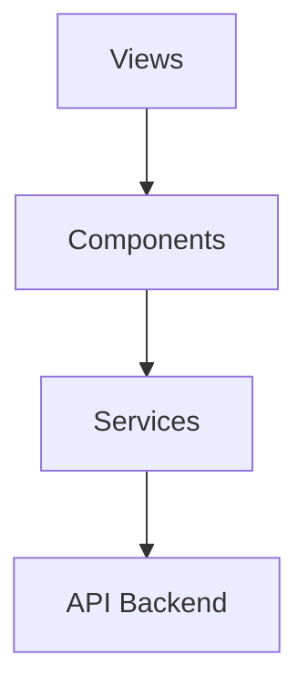

# 📝 NoteesApp UI


Interface moderna e responsiva para **gerenciamento de notas**, permitindo organização por **pastas**, **tags**, **busca em tempo real** e **fixação de notas importantes**.

O projeto foi desenvolvido utilizando **Vue 3 (Composition API)**, **TypeScript** e **Vite**, seguindo boas práticas de arquitetura frontend, componentização e design responsivo **mobile-first**.

Este projeto foi criado como **projeto de portfólio** para demonstrar habilidades em **Frontend moderno**, integração com APIs REST e construção de interfaces escaláveis.

---

# 🔗 Links do Projeto

| Recurso | Link |
|------|------|
| Frontend (GitHub) | https://github.com/PedroBeltraoDev/NoteesApp-UI |
| Aplicação em Produção | https://notees-app-ui.vercel.app |
| Backend API | https://noteesapp-be.onrender.com/api |

---
# 🚀 Tecnologias Utilizadas

| Categoria | Tecnologia |
|---|---|
| Framework | Vue 3 (Composition API) |
| Linguagem | TypeScript |
| Build Tool | Vite |
| Roteamento | Vue Router |
| Comunicação API | Fetch API |
| Estilização | CSS Variables |
| Design | Mobile-first + Responsive |
| Deploy | Vercel |
| Backend | NoteesApp API (.NET) |

---

# 🏗️ Arquitetura

A aplicação segue uma arquitetura baseada em **camadas de responsabilidade**, facilitando manutenção, escalabilidade e organização do código.

```
Views
  │
  ▼
Components
  │
  ▼
Services
  │
  ▼
API
```

---

# 📊 Diagrama de Arquitetura



---

# 📁 Estrutura do Projeto

```text
src
│
├── components
│   ├── layout
│   │   ├── Topbar.vue
│   │   └── Sidebar.vue
│   │
│   └── notes
│       ├── NoteCard.vue
│       ├── NoteFormModal.vue
│       └── NotesGrid.vue
│
├── views
│   ├── LoginView.vue
│   ├── DashboardView.vue
│   └── SettingsView.vue
│
├── services
│   └── api.ts
│
├── router
│   └── index.ts
│
├── middleware
│   └── auth.ts
│
├── assets
│   └── styles
│
├── App.vue
└── main.ts

public/

.env.local
.env.production

package.json
vite.config.ts
tsconfig.json
vercel.json
```

---

# ✨ Funcionalidades

| Feature | Descrição |
|---|---|
| CRUD de Notas | Criar, editar, excluir e visualizar notas |
| Pastas | Organização de notas por pastas |
| Tags | Classificação de notas por tags |
| Busca em tempo real | Filtragem instantânea |
| Fixar notas | Destacar notas importantes |
| Filtros | Ordenação e filtragem |
| Design Responsivo | Mobile-first |
| Login simples | Autenticação por senha |
| Dark Theme | Interface escura moderna |
| Loading States | Feedback visual durante requisições |
| Confirmação de exclusão | Evita exclusões acidentais |
| Validação de formulários | Inputs validados |
| Mensagens de erro | Feedback amigável |
| Empty states | Estados quando não há notas |

---

# 🔐 Autenticação

A aplicação utiliza um **sistema simples de autenticação por senha** configurado via variável de ambiente.

### Funcionamento

- Usuário insere senha na tela de login
- A senha é validada no frontend
- Sessão é armazenada no **localStorage**
- Sessão expira em **24 horas**
- Rotas protegidas utilizam **Route Guards**

### Segurança implementada

| Recurso | Descrição |
|---|---|
| Route Guard | Protege páginas internas |
| localStorage | Armazena sessão temporária |
| Logout | Limpeza completa da sessão |

---

# 📱 Design Responsivo

A interface foi construída utilizando **Mobile First Design**.

| Dispositivo | Layout |
|---|---|
| Mobile (<640px) | Menu hamburguer, 1 coluna |
| Tablet (641–768px) | Menu hamburguer, 2 colunas |
| Desktop (>769px) | Sidebar fixa, 3 colunas |
| Large (>1200px) | Sidebar fixa, 4 colunas |

Modal behavior:

| Tela | Modal |
|---|---|
| Mobile | Bottom modal fullscreen |
| Tablet | Modal centralizado |
| Desktop | Modal centralizado |

---

# 🎨 Design System

A interface utiliza **CSS Variables** para manter consistência visual e facilitar manutenção.

## Cores

```css
:root {
  --bg-primary: #1a1a1a;
  --bg-secondary: #2d2d2d;
  --bg-tertiary: #3d3d3d;

  --text-primary: #ffffff;
  --text-secondary: #a0a0a0;
  --text-tertiary: #666666;

  --accent-color: #3b82f6;
  --accent-hover: #2563eb;

  --border-color: #404040;

  --success-color: #10b981;
  --error-color: #dc2626;
  --warning-color: #f59e0b;
}
```

---

# 📐 Breakpoints

A aplicação segue **Mobile First**, expandindo o layout conforme o tamanho da tela.

```css
/* Mobile (default) */

@media (min-width: 641px) {
  /* Tablet Small */
}

@media (min-width: 769px) {
  /* Desktop */
}

@media (min-width: 1200px) {
  /* Large Desktop */
}
```

---

# ⚙️ Instalação

Clone o projeto:

```bash
git clone https://github.com/PedroBeltraoDev/NoteesApp-UI.git
```

Entre na pasta do projeto:

```bash
cd notees-app
```

Instale as dependências:

```bash
npm install
```

Copie o arquivo de ambiente:

```bash
cp .env.example .env.local
```

Inicie o servidor de desenvolvimento:

```bash
npm run dev
```

---

# 🤝 Como Contribuir

1. Faça um **fork** do projeto  
2. Crie uma branch

```bash
git checkout -b feature/minha-feature
```

3. Faça commit das alterações

```bash
git commit -m "feat: minha nova feature"
```

4. Envie para o GitHub

```bash
git push origin feature/minha-feature
```

5. Abra um **Pull Request**

---

# 📄 Licença

Este projeto está licenciado sob a **MIT License**.

---

# 👨‍💻 Autor

**Pedro Beltrão**

GitHub  
https://github.com/PedroBeltraoDev
